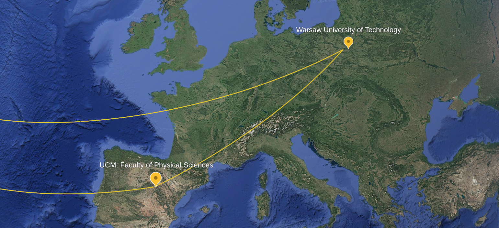
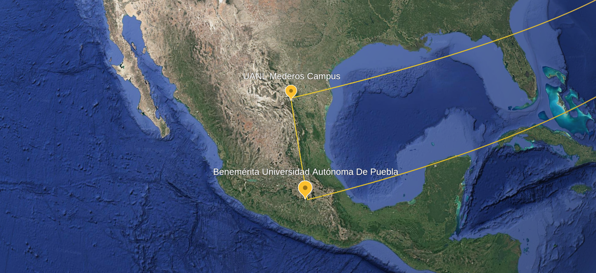
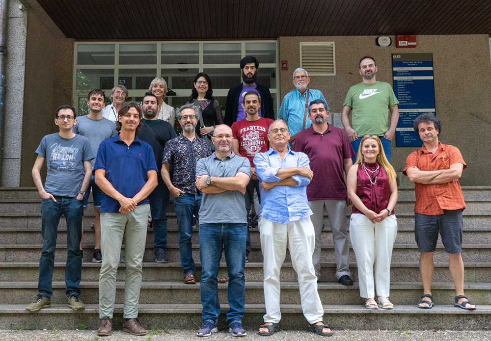
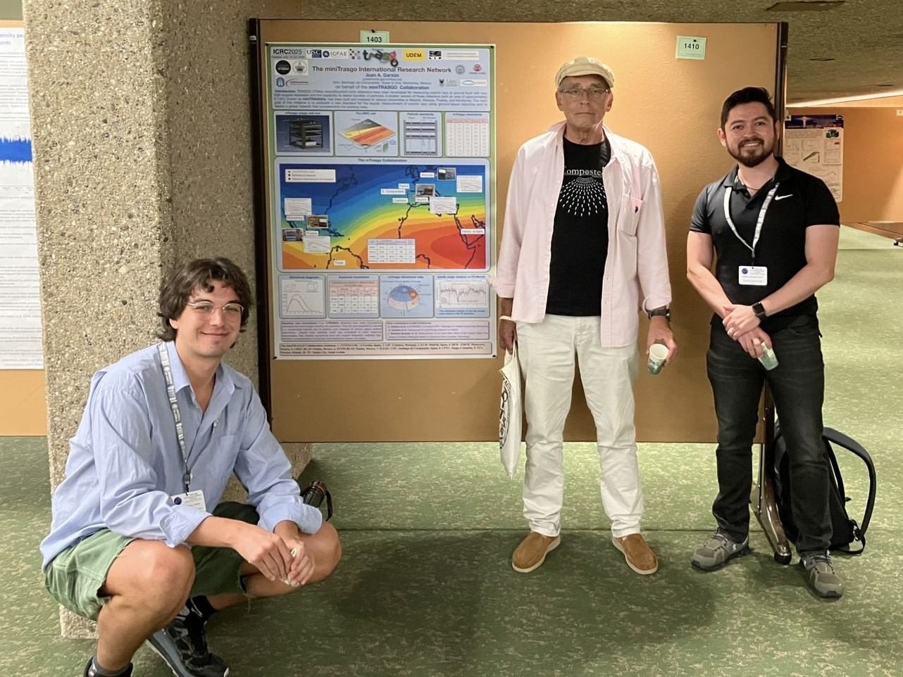

# Collaborators

## Technical leadership

| Responsibility | Person | Scope |
| --- | --- | --- |
| Concept lead | Juan A. Garzon | Scientific and project concept framing |
| Detector construction and maintenance lead | Alberto Blanco | Detector build, hardware maintenance, operations readiness |
| Analysis software lead and Madrid station responsible | C. Soneira-Landin | `MASTER` software leadership and Madrid station software responsibility |
| Warsaw station responsible (collaborator) | Georgy Kornakov | Warsaw station technical coordination |
| Monterrey station responsible | Humberto | Monterrey station coordination |
| Puebla station responsible | Oliver | Puebla station coordination |

For direct contact details, see [Appendix Contact List](../appendices/contact-list.md).

## Institutions

- Universidad Complutense de Madrid (UCM), Spain
- Universidade de Santiago de Compostela (USC), Spain
- LIP Coimbra, Portugal
- IFIC Valencia, Spain
- Warsaw University of Technology, Poland
- Benemerita Universidad Autonoma de Puebla, Mexico
- Universidad Pedagogica y Tecnologica de Colombia, Colombia

## Station location and collaboration figures

