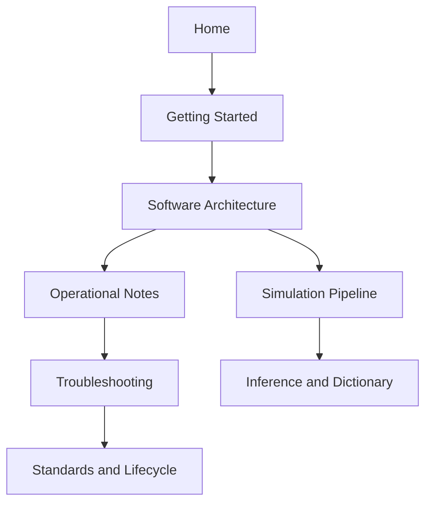

# Reader Guide

This guide helps contributors navigate DATAFLOW_v3 documentation efficiently by role and task.

## Role-based reading paths

| Role | Start here | Then read | Focus |
| --- | --- | --- | --- |
| New developer | [Getting Started](index.md) | [Software](../software/index.md), [Code Structure](../software/code-structure.md) | Understand where logic lives and how to run/validate changes |
| Operator | [Hardware](../hardware/index.md) | [Operational Notes](../operations/index.md), [Troubleshooting](../troubleshooting/index.md) | Keep runtime healthy and recover safely |
| Analyst | [Software](../software/index.md) | [Inference](../software/inference-and-dictionary.md), [Data Dictionaries](../appendices/data-dictionaries.md) | Trace physics/inference assumptions to outputs |
| Maintainer | [Standards](../standards/index.md) | [Documentation Lifecycle](../standards/documentation-lifecycle.md), [Repository Sources](../references/source-documents.md) | Keep docs, code, and operations aligned |

## Recommended reading sequence

## How to read technical pages

Use this pattern on each page:

1. **Scope**: what system boundary the page covers.
2. **Paths**: where the corresponding code/scripts live.
3. **Execution flow**: how data/state move between stages.
4. **Validation**: commands/checks that prove behavior.
5. **References**: canonical docs and runbooks.

!!! tip "Fastest way to avoid context loss"
    Before editing code, open the corresponding architecture/workflow page and the linked canonical source doc. This keeps changes aligned with current operational behavior.

## Professional reading habits

- Prefer canonical sources (`DOCS/`, `MINGO_DIGITAL_TWIN/DOCS/`) when behavior detail matters.
- Treat legacy pages as context, not source of truth.
- When code and docs disagree, update docs in the same pull request.
