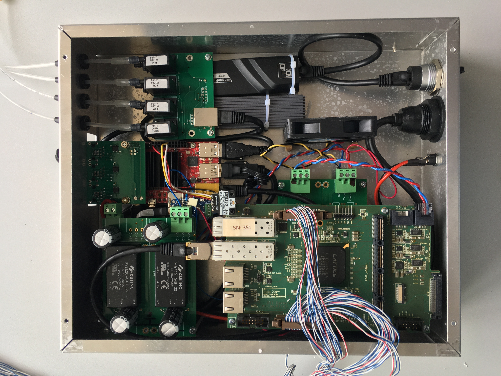
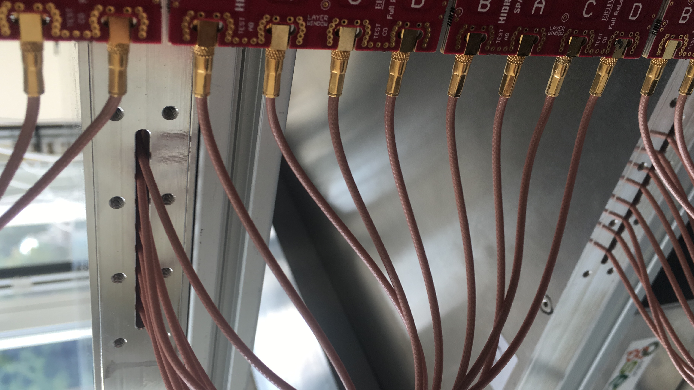

# DAQ and Infrastructure

## Electronics and DAQ chain

Typical signal path:

1. RPC strip signals are conditioned by front-end electronics (FEE).
2. Digital timing/width measurements are captured by TRB-based electronics.
3. Acquisition services write raw DAQ files (`.hld`) on station storage.
4. Unpacking/analysis services produce derived outputs used by downstream software.

*DAQ/readout electronics internals used in the station chain.*

## Station software environment

Typical station host capabilities include:

- `tmux` sessions for persistent DAQ/ops shells
- Cron-managed DAQ and slow-control scripts
- Lookup tables for calibration and alarm thresholds
- Logs for sensors, flow, HV, and trigger/rate behavior

Operational environment details are summarized in:
- [Legacy Environment Notes](../design/environment.md)
- [Configuration Procedure](../operation/configuration.md)

## Data path and formats

Common hardware-adjacent formats:

- Raw DAQ: `.hld`
- Intermediate/legacy: `.mat`
- Station exchange format: `.dat`
- Slow-control logs: timestamped `.log` files

The simulation STEP_FINAL output is intentionally formatted to match station-style `.dat` payload expectations.

## Operational dependencies

Hardware stability depends on:

- Reliable gas flow and HV control
- Stable trigger/threshold settings
- Correct cable offsets and calibration constants
- Healthy network/storage on station host

*Representative front-end cabling and connector detail.*
