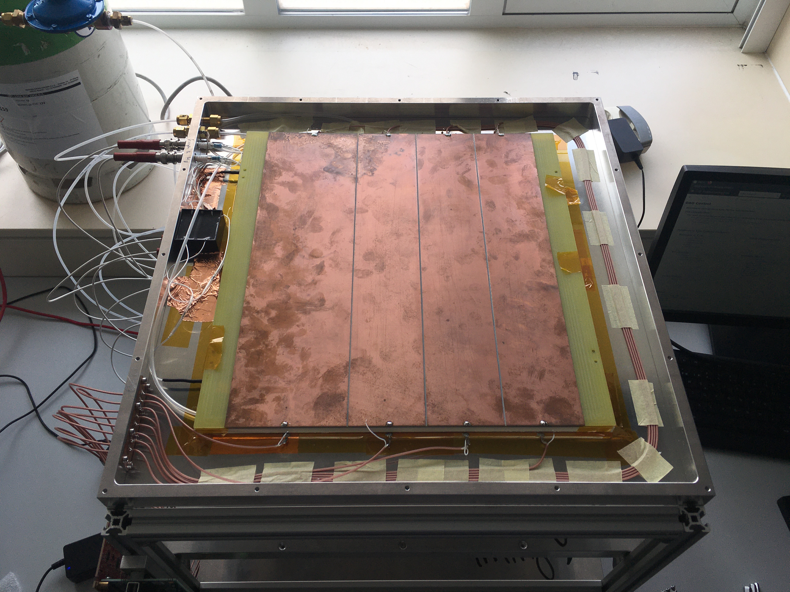
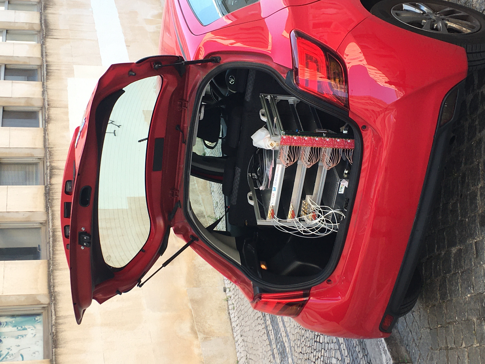

# Maintenance and Calibration

This page consolidates routine station maintenance and calibration practices.

## Routine startup checklist

- Verify station connectivity (SSH and required services).
- Confirm slow-control logging is active.
- Confirm HV and gas flow are within expected operating ranges.
- Confirm DAQ process is running and writing files.
- Confirm trigger configuration and rates are reasonable.

## Calibration domains

| Domain | Goal |
| --- | --- |
| Time-to-position | Map front/back timing differences to spatial coordinates |
| Gas flow | Verify meter response and detect leaks/flow drops |
| Plateau/efficiency scan | Select stable HV operating region |
| TDC calibration | Maintain timing conversion accuracy |
| Charge calibration | Maintain TOT-to-charge conversion stability |

Detailed procedures:
- [Calibration Procedures](../operation/calibration.md)

## Monitoring-driven maintenance

Use daily/periodic diagnostics to detect drift:

- Charge/time correlation plots
- Spatial maps (hot/dead regions)
- Streamer fraction and charge spectra
- Sensor/HV/gas trend logs

Detailed diagnostics:
- [Monitoring and QA](../operation/monitoring.md)

*Open RPC module during strip and gas-line integration checks.*

## Safety and handling notes

- Never ignore persistent gas-flow anomalies.
- Apply transport precautions for pressurized gas lines and RPC handling.
- Avoid in-run HV changes unless operationally necessary and documented.

## Escalation triggers

Escalate to hardware/software leads when:

- HV current jumps unexpectedly and remains unstable.
- Streamer fraction remains elevated over sustained windows.
- DAQ output becomes empty or malformed.
- Sensor logs stop updating without planned maintenance.

*Transport configuration example for station logistics and handling.*
