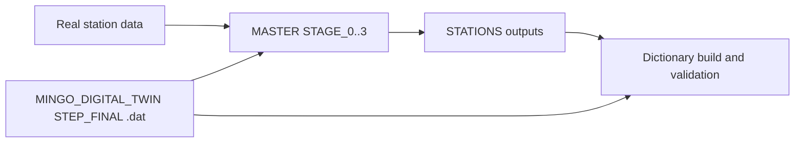

# DATAFLOW_v3 Documentation

`MASTER` is the analysis mother code for real and simulated station-format data. `STATIONS` is where station outputs are materialized. `MINGO_DIGITAL_TWIN` provides traceable simulation used for validation and dictionary-based reconstruction.

## Start here by task

| If you need to... | Read first | Then |
| --- | --- | --- |
| Review the project for funding/collaboration | [Project Dossier](project/index.md) | [Work Packages](project/work-packages.md), [Quality Assurance Plan](project/quality-assurance.md) |
| Modify analysis/simulation/inference code | [Software](software/index.md) | [Software Invariants](software/invariants.md), [Change Impact Matrix](software/change-impact-matrix.md) |
| Run or recover production jobs | [Operational Notes](operations/index.md) | [Cron, Locks, and Maintenance](operations/cron-and-maintenance.md), [Common Issues](troubleshooting/common-issues.md) |
| Understand detector context | [Hardware](hardware/index.md) | [Detector Stations](hardware/detector-stations.md) |

## System in one diagram

## Canonical repository references

- `DOCS/REPO_DOCS/REPOSITORY_GOVERNANCE.md`
- `DOCS/BEHAVIOUR/CRON_AND_SCHEDULING.md`
- `DOCS/REPO_DOCS/TROUBLESHOOTING/OPERATIONS_RUNBOOK.md`
- `MINGO_DIGITAL_TWIN/DOCS/README.md`
- `MINGO_DIGITAL_TWIN/DOCS/contracts/STEP_CONTRACTS.md`
