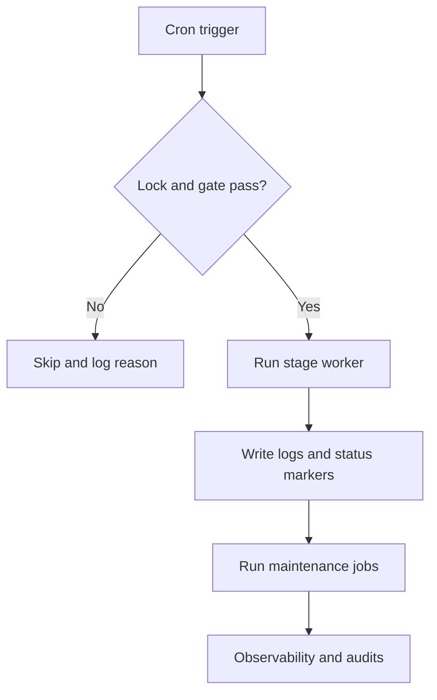

# Cron, Locks, and Maintenance Scripts

## Scheduling model

Cron is the default orchestrator for both analysis and simulation workflows.

Key behaviors:

- `flock -n` guards prevent overlapping job instances.
- Resource gates may skip jobs under pressure conditions.
- Main simulation cycle applies frequency and backpressure controls.


*Figure 3. Cron-triggered workers coordinated by locks, gates, and maintenance jobs with shared observability outputs.*

## Runtime control flow



## Critical runtime logs

- `OPERATIONS_RUNTIME/CRON_LOGS/MAIN_ANALYSIS/...`
- `OPERATIONS_RUNTIME/CRON_LOGS/SIMULATION/RUN/sim_main_pipeline_cycle.log`
- `OPERATIONS_RUNTIME/CRON_LOGS/SIMULATION/ANCILLARY/...`

## Fast health checks

```bash
service cron status
crontab -l

pgrep -af "guide_raw_to_corrected.sh -s"
pgrep -af "run_main_simulation_cycle.sh|run_step.sh -c|step_final_daq_to_station_dat.py"

tail -n 80 $HOME/DATAFLOW_v3/OPERATIONS_RUNTIME/CRON_LOGS/SIMULATION/RUN/sim_main_pipeline_cycle.log
```

## Maintenance scripts

### Simulation maintenance

- `MINGO_DIGITAL_TWIN/ORCHESTRATOR/maintenance/sanitize_sim_runs.py`
- `MINGO_DIGITAL_TWIN/ORCHESTRATOR/maintenance/ensure_sim_hashes.py`
- `MINGO_DIGITAL_TWIN/ORCHESTRATOR/maintenance/prune_step_final_params.py`

### Observability and audits

- `OPERATIONS/OBSERVABILITY/AUDIT_PIPELINE_STATES/audit_pipeline_states.py`
- `OPERATIONS/OBSERVABILITY/SEARCH_FOR_ERRORS/error_finder.py` (if present in environment)

## Incident triage order

1. Confirm process presence and lock state.
2. Confirm log freshness and stage progression.
3. Confirm queue and metadata movement.
4. Run consistency/audit scripts.
5. Apply targeted recovery only at failing step boundary.

## Canonical references

- Scheduling baseline: <https://github.com/csoneira/DATAFLOW_v3/blob/main/DOCS/BEHAVIOUR/CRON_AND_SCHEDULING.md>
- Incident history and recovery: <https://github.com/csoneira/DATAFLOW_v3/blob/main/DOCS/REPO_DOCS/TROUBLESHOOTING/OPERATIONS_RUNBOOK.md>
- Simulation troubleshooting: <https://github.com/csoneira/DATAFLOW_v3/blob/main/MINGO_DIGITAL_TWIN/DOCS/TROUBLESHOOTING/RUNBOOK.md>
