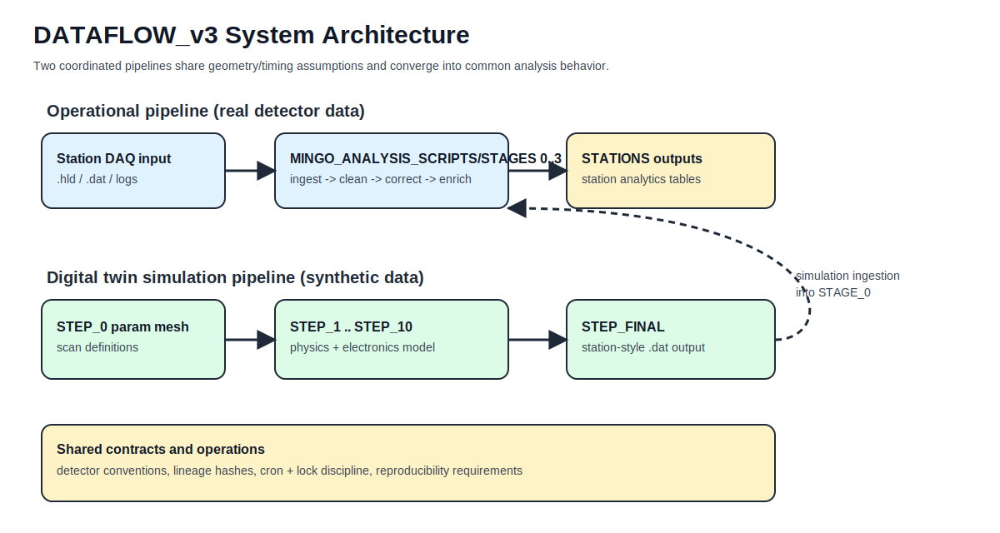
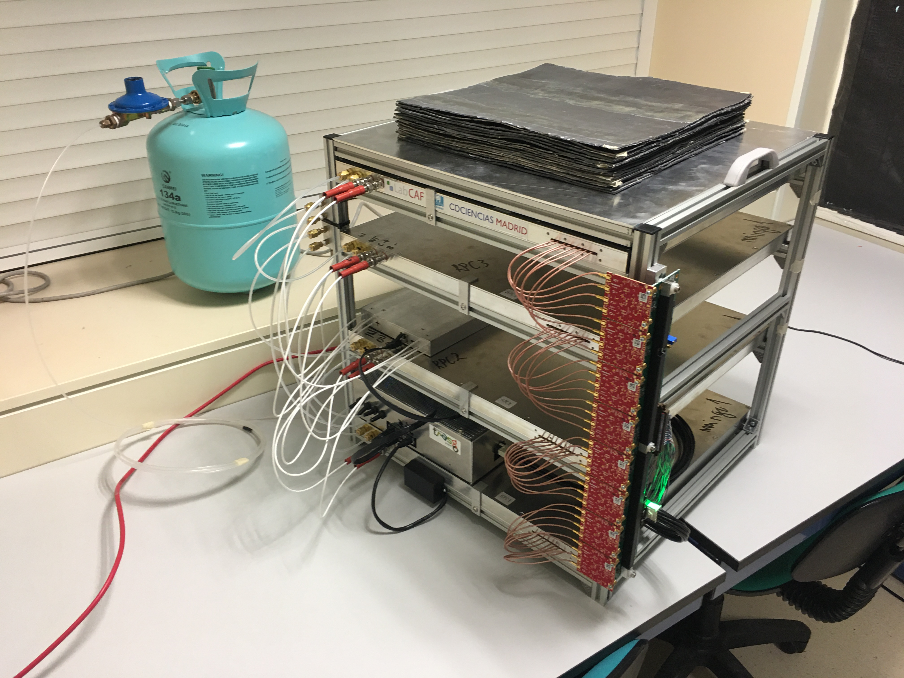
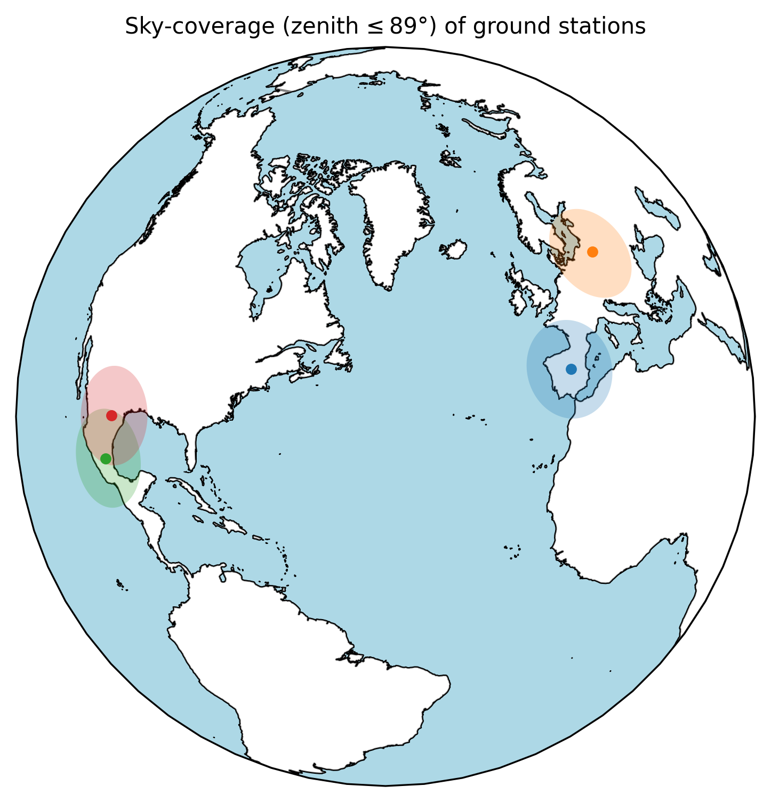

# Project Dossier

## Project statement

DATAFLOW_v3 is the software backbone of a distributed miniTRASGO/RPC collaboration. It couples:

1. Operational analysis of station data.
2. Deterministic detector/electronics simulation.
3. Dictionary-based reconstruction linking simulation and measurement.

## Architecture snapshot

## Instrument snapshot

## Collaboration snapshot

## Reviewer quick map

| Typical review question | Page |
| --- | --- |
| What scientific/technical problem is solved? | [Scientific Case](scientific-case.md) |
| How is work partitioned and connected? | [Work Packages](work-packages.md) |
| How is quality controlled (calibration, purity, validity)? | [Quality Assurance Plan](quality-assurance.md) |
| Who is responsible and where are stations? | [Governance and Sites](governance-and-sites.md) |
| What are targets, deliverables, and risks? | [Milestones, Deliverables, and Risk](milestones-deliverables-risk.md) |
