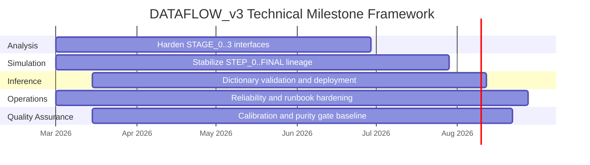

# Milestones, Deliverables, and Risk

## Milestone framework

## Deliverables

| ID | Deliverable | Acceptance signal |
| --- | --- | --- |
| D1 | Stable real/sim analysis path | Reproducible stage outputs and no unresolved interface drift |
| D2 | Simulation provenance integrity | Hash/registry checks pass |
| D3 | Reconstruction package | Validated dictionary artifact in production use |
| D4 | Operations reliability baseline | Scheduling/lock behavior and recovery checks reproducible |
| D5 | QA gate baseline | Calibration-variable checks and data-purity acceptance criteria are enforced in routine runs |

## Review cadence

| Cadence | Review focus | Primary evidence |
| --- | --- | --- |
| Daily operations | Runtime continuity and lock health | Cron logs, lock status, queue movement |
| Weekly technical | Interface drift and quality regressions | Stage summaries, QA gate reports, hash audits |
| Monthly project | Milestone trajectory and risk status | Deliverable status and unresolved risk log |

## Key risks and mitigation

| Risk | Mitigation |
| --- | --- |
| Simulation-analysis interface drift | Contract checks + ingest validation + trace docs |
| Hidden non-determinism | Seed policy + lineage metadata + validation checks |
| Scheduler/lock regressions | Lock/gate audits + runbook enforcement |
| Inference version mismatch | Versioned artifacts + validation-gated updates |
| Calibration drift or purity degradation goes unnoticed | Mandatory QA gate reports for calibration variables and purity indicators |
