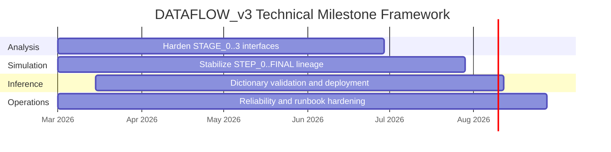

# Milestones, Deliverables, and Risk

## Milestone structure

## Deliverables (technical)

| ID | Deliverable | Acceptance signal |
| --- | --- | --- |
| D1 | Stable analysis path for real + simulated ingestion | Reproducible stage outputs and no unresolved interface drift |
| D2 | Digital-twin provenance integrity | Hash/registry checks pass and runbook checks remain green |
| D3 | Dictionary-based reconstruction package | Validation diagnostics and deployable inference artifact |
| D4 | Operations reliability baseline | Scheduling/lock behavior documented and incident recovery reproducible |

## Risk register (software-centric)

| Risk | Impact | Mitigation |
| --- | --- | --- |
| Interface drift between simulation output and analysis ingest | Loss of comparability across data domains | Contract checks + trace docs + targeted ingest validation |
| Hidden non-determinism in pipeline steps | Reproducibility degradation | Explicit seed policy + metadata lineage + validation checks |
| Scheduler/lock regressions | Stalls or process overlap | Lock/gate audits + runbook enforcement + observability checks |
| Inference artifact/version mismatch | Reconstruction bias risk | Versioned dictionary artifacts + validation-gated updates |

## Review cadence

- Continuous: behavior-impacting changes update docs/contracts in same PR.
- Periodic: operational and reproducibility audits aligned with runbook practice.

