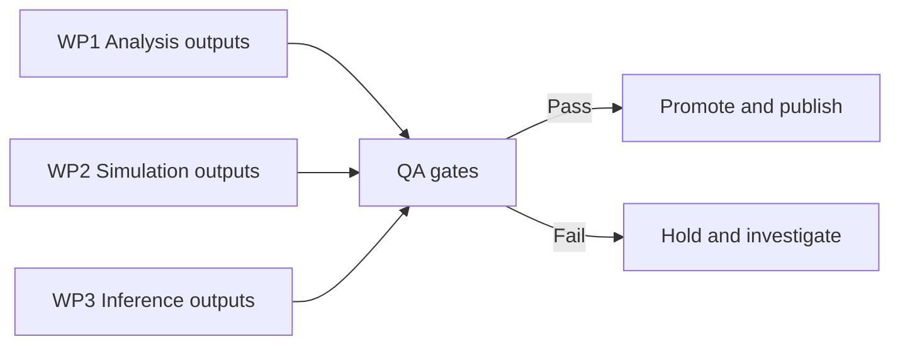

# Quality Assurance Plan

## Purpose

Define how DATAFLOW_v3 decides whether outputs are acceptable for physics use. QA is treated as a promotion gate, not a post-hoc report.

## Gate model

## QA gates

| Gate | What is checked | Typical evidence |
| --- | --- | --- |
| G1 Ingestion integrity | Stage progress, queue movement, and file/log freshness | Stage logs, queue state, `audit_pipeline_states.py` outputs |
| G2 Calibration variables | Completeness/consistency of pressure, temperature, HV, gas flow, lab logs before correction usage | Stage 1-2 merged tables and station calibration logs |
| G3 Data purity and stability | Noise/quality flags, rate stability, and rejection behavior by run window | Stage outputs, monitoring plots, reject/error counters |
| G4 Simulation provenance | Hash/lineage consistency and contract compliance of simulation artifacts | `.meta.json`, registries, `ensure_sim_hashes.py` checks |
| G5 Reconstruction validity | Dictionary residual behavior and consistency against simulation assumptions | Dictionary validation outputs and versioned metadata |

## Decision policy

- **Pass**: all mandatory gates pass; no unresolved critical warnings.
- **Conditional pass**: one noncritical gate warning with written justification and follow-up date.
- **Fail**: any critical gate fails or provenance is inconsistent.

## Operational ownership

| QA area | Primary owner |
| --- | --- |
| Calibration and detector quality | Detector maintenance lead + station responsible |
| Analysis output consistency | Analysis software lead |
| Simulation lineage consistency | Digital twin maintainers |
| Reconstruction validation | Dictionary/inference maintainers |

Ownership details are listed in [Governance and Sites](governance-and-sites.md).

## Example diagnostic used in QA discussions

This figure is illustrative; final decisions are based on full QA gate evidence, not a single plot.
