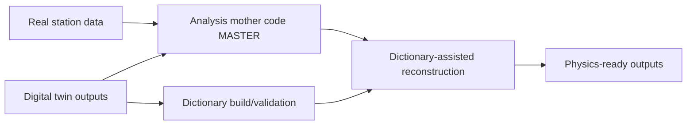

# Scientific Case

## Scientific motivation

The project targets robust, long-term cosmic-ray monitoring using distributed RPC stations, with software designed to preserve comparability across sites and across time.

## Core physics-computing challenge

Reliable interpretation requires three tightly coupled capabilities:

1. Stable and reproducible analysis of real station data.
2. Controlled synthetic data generation to test assumptions and biases.
3. Reconstruction methods that explicitly connect measured observables to simulated physical states.

## DATAFLOW_v3 response

- **Analysis layer**: `MASTER` + `STATIONS` provide consistent operational processing.
- **Simulation layer**: `MINGO_DIGITAL_TWIN` provides deterministic stepwise detector/electronics modeling.
- **Inference layer**: dictionary workflows connect simulation knowledge to real-data interpretation.

## Evidence of technical maturity

- Explicit step contracts and lineage metadata.
- Hash validation and maintenance scripts.
- Operational runbooks and scheduling discipline.
- Collaboration-owned responsibilities by subsystem and station.

