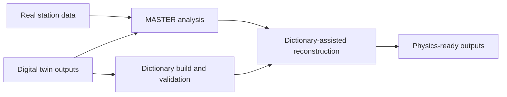

# Scientific Case

## Objective

Build a robust software framework for distributed RPC cosmic-ray stations with reproducible analysis, traceable simulation, and deployable reconstruction.

## Computing-science requirement

Reliable physics interpretation needs all three layers coupled:

- Analysis of real detector data.
- Controlled synthetic data generation.
- Reconstruction methods validated against simulation provenance.

## Software response

## Maturity signals

- Step/interface contracts.
- Hash and lineage checks.
- Scheduler/lock operational controls.
- Defined subsystem and station responsibilities.

