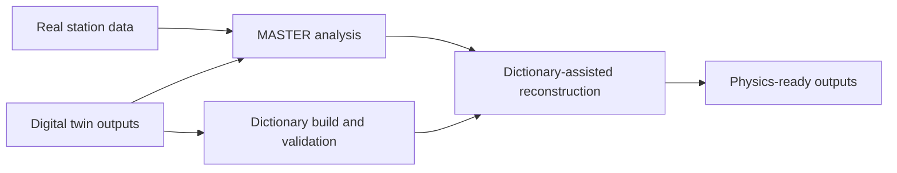

# Scientific Case

## Problem

Distributed RPC stations produce heterogeneous raw data streams. Physics interpretation is only reliable if calibration, corrections, and reconstruction are reproducible across sites and over time.

## Why this architecture

| Requirement | DATAFLOW_v3 response |
| --- | --- |
| Real operations must run continuously | `MASTER/STAGES` pipeline with station-scoped outputs in `STATIONS/` |
| Reconstruction must be testable, not ad hoc | Digital twin (`MINGO_DIGITAL_TWIN`) generates controlled `.dat` inputs |
| Inference must stay aligned with detector model assumptions | Dictionary workflows are tied to simulation provenance and hashes |

## Software response

## Evidence of maturity

| Signal | Evidence source |
| --- | --- |
| Interface discipline | Step contracts and stage boundaries (`MINGO_DIGITAL_TWIN/DOCS/contracts/`, `MASTER/STAGES/`) |
| Reproducibility and lineage | Hash sidecars, registries, and validation scripts |
| Operations discipline | Cron + lock model and runbooks in `DOCS/BEHAVIOUR/` and `DOCS/REPO_DOCS/` |
| Data quality control | Calibration-variable and purity QA gates ([Quality Assurance Plan](quality-assurance.md)) |
| Clear accountability | Named technical responsibilities and station ownership ([Governance and Sites](governance-and-sites.md)) |
