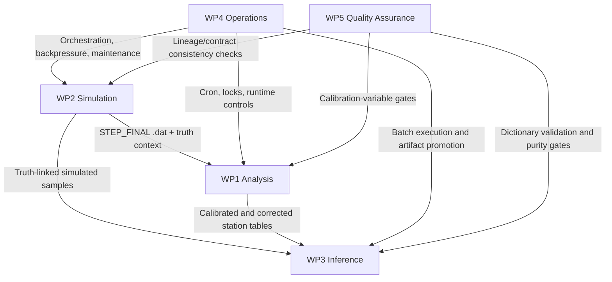

# Work Packages

## Scope map

| WP | Package | Main objective | Primary scope |
| --- | --- | --- | --- |
| WP1 | Analysis Software | Deterministic production analysis for real and simulated station-format data | `MASTER/STAGES/STAGE_0..3`, `STATIONS/` |
| WP2 | Simulation (Digital Twin) | Reproducible synthetic detector output with full lineage | `MINGO_DIGITAL_TWIN/MASTER_STEPS`, `MINGO_DIGITAL_TWIN/ORCHESTRATOR/`, `MINGO_DIGITAL_TWIN/INTERSTEPS/` |
| WP3 | Dictionary-Based Inference | Reconstruction layer where simulation and real data meet | `MINGO_DICTIONARY_CREATION_AND_TEST/`, `MASTER/common/simulated_data_utils.py` |
| WP4 | Operations and Reliability | Stable runtime orchestration, locking, housekeeping, and recovery | `OPERATIONS/`, `OPERATIONS_RUNTIME/`, `DOCS/BEHAVIOUR/` |
| WP5 | Quality Assurance | Quantitative run acceptance based on calibration variables and data purity | Stage QA checks, dictionary validation routines, simulation lineage audits |

## Outputs and gates

| WP | Entry artifact | Exit artifact | Gate for promotion |
| --- | --- | --- | --- |
| WP1 | Real `.hld/.dat` or simulated `.dat` inputs | Corrected/enriched station outputs in `STATIONS/` | Stage checks complete, no unresolved ingest/correction failures |
| WP2 | Mesh + configs | STEP_FINAL `.dat` + metadata registries | Hash/lineage checks pass, contracts respected |
| WP3 | Simulation-derived dictionary training inputs + measured rates | Versioned dictionary artifacts + reconstruction outputs | Validation residuals acceptable, metadata matches source assumptions |
| WP4 | Scheduled jobs and runtime state | Fresh logs, healthy queues, stable lock behavior | No stale locks, expected cadence, recoverable incident state |
| WP5 | Outputs from WP1-WP3 | QA report and acceptance/rejection decision | Calibration and purity thresholds satisfied |

## Dependency model (artifact-driven)

## WP5 Quality Assurance: acceptance checks

| QA domain | Typical checks | Affected WPs |
| --- | --- | --- |
| Calibration-variable integrity | Pressure/temperature/HV/gas and lab-log completeness before corrections are trusted | WP1 |
| Data purity and stability | Run-level purity indicators, noise/quality flags, consistency over time windows | WP1, WP3 |
| Reconstruction consistency | Dictionary output sanity and mismatch checks between observed and simulated behavior | WP3 |
| Provenance and determinism | Hash/lineage validation and contract conformance in simulation artifacts | WP2 |

See [Quality Assurance Plan](quality-assurance.md) for concrete gate definitions and review cadence.
