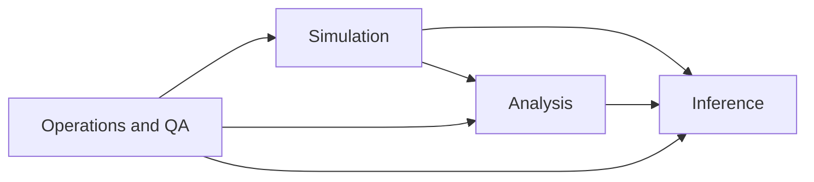

# Work Packages

## WP1: Analysis Software

- **Scope**: `MASTER/STAGES/STAGE_0..3` with output materialization in `STATIONS/`.
- **Goal**: stable processing for real + simulated inputs.

## WP2: Simulation (Digital Twin)

- **Scope**: `MINGO_DIGITAL_TWIN/MASTER_STEPS`, orchestrator, intersteps, final `.dat` emission.
- **Goal**: reproducible synthetic data with explicit lineage.

## WP3: Dictionary-Based Inference

- **Scope**: `MINGO_DICTIONARY_CREATION_AND_TEST` and `MASTER/common/simulated_data_utils.py`.
- **Goal**: validated reconstruction bridge between simulation and measurement.

## WP4: Operations and Quality (cross-cutting)

- **Scope**: scheduling, locking, observability, metadata integrity, incident response.
- **Code/docs**: `OPERATIONS/`, `OPERATIONS_RUNTIME/`, `DOCS/REPO_DOCS/`, `DOCS/BEHAVIOUR/`.

## Package interaction

