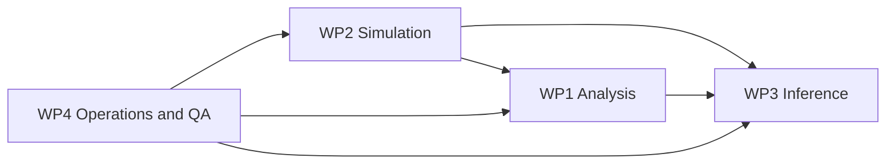

# Work Packages

The project is organized into three primary technical work packages, with a cross-cutting operations layer.

## WP1: Analysis Software (MASTER + STATIONS)

**Scope**
- Ingestion, cleaning, correction, enrichment for real and simulated inputs.

**Primary outputs**
- Station-scoped processed artifacts under `STATIONS/MINGO0X/...`.

**Key code areas**
- `MASTER/STAGES/STAGE_0..STAGE_3`

## WP2: Simulation (Digital Twin)

**Scope**
- Deterministic simulation from parameter mesh to station-style `.dat` outputs.

**Primary outputs**
- Intersteps, registries, and final simulated files.

**Key code areas**
- `MINGO_DIGITAL_TWIN/MASTER_STEPS/`
- `MINGO_DIGITAL_TWIN/ORCHESTRATOR/`

## WP3: Dictionary-Based Inference (Reconstruction)

**Scope**
- Build, validate, and deploy inference dictionaries linking observables to physical parameters.

**Primary outputs**
- Versioned dictionary artifacts and validation diagnostics.

**Key code areas**
- `MINGO_DICTIONARY_CREATION_AND_TEST/`
- `MASTER/common/simulated_data_utils.py`

## Cross-cutting WP4: Operations, Reproducibility, and Quality

**Scope**
- Scheduling, lock/gate control, metadata integrity, incident response.

**Key code/docs areas**
- `OPERATIONS/`, `OPERATIONS_RUNTIME/`
- `DOCS/REPO_DOCS/`, `DOCS/BEHAVIOUR/`

## Package interaction

