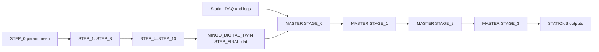

# Architecture Overview

## System model

DATAFLOW_v3 is a coupled scientific software system with two production-grade pipelines:

- **MASTER analysis mother code** processes both real station inputs and simulated station-format inputs.
- **Digital twin pipeline** generates synthetic station-like data through deterministic stepwise simulation.

The system is designed so simulated outputs can move through the same `MASTER` downstream assumptions as real outputs, with outputs materialized in `STATIONS/`.

*Figure 1. DATAFLOW_v3 dual-pipeline architecture with convergence through simulation ingestion into `MASTER/STAGE_0`, then output materialization in `STATIONS/`.*

## Logical component graph

## Domain boundaries

| Domain | Main paths | Purpose |
| --- | --- | --- |
| Analysis and station outputs | `MASTER/`, `STATIONS/` | `MASTER` runs analysis stages for real/simulated inputs; `STATIONS` stores station-scoped outputs and processing state |
| Simulation | `MINGO_DIGITAL_TWIN/` | Physics + electronics modeling from muon generation to DAQ-style output |
| Inference/dictionary | `MINGO_DICTIONARY_CREATION_AND_TEST/`, `MASTER/common` | Build and consume lookup tables for flux/efficiency inference |
| Orchestration and observability | `OPERATIONS/`, `OPERATIONS_RUNTIME/` | Scheduling, locking, health audits, logs, runtime state |

## Shared contracts across domains

- Consistent detector geometry conventions
- Consistent timing and charge field semantics
- Provenance metadata (`config_hash`, step IDs, lineage)
- Reproducibility controls via config-driven behavior

Detailed step contracts are maintained in:
- <https://github.com/csoneira/DATAFLOW_v3/blob/main/MINGO_DIGITAL_TWIN/DOCS/contracts/STEP_CONTRACTS.md>

## Scheduling and locking model

- Cron-driven execution with `flock` locks and resource gates
- Main simulation cycle orchestrated by `run_main_simulation_cycle.sh`
- Operational stage workers launched at defined cadences per station

Canonical scheduling reference:
- <https://github.com/csoneira/DATAFLOW_v3/blob/main/DOCS/BEHAVIOUR/CRON_AND_SCHEDULING.md>

## Design priorities

1. Reproducibility from committed code and configuration.
2. Deterministic replay where required.
3. Explicit provenance and lineage for generated artifacts.
4. Operational safety (non-overlapping cron jobs, lock discipline, non-destructive data handling).
