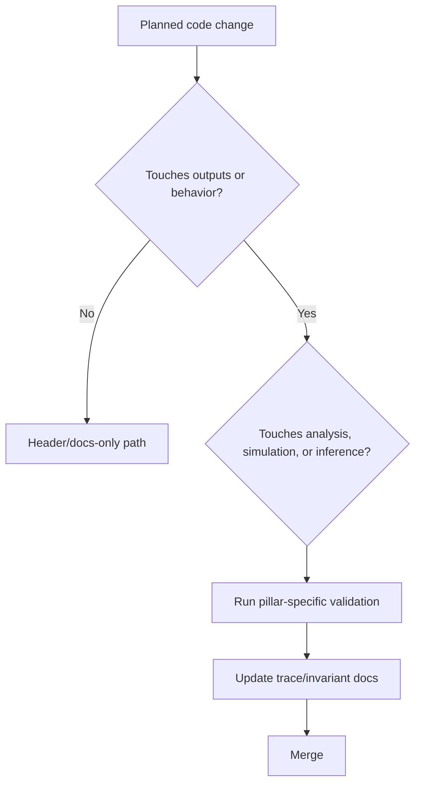

# Change Impact Matrix

Use this before modifying code. It is the fastest way to scope risk.

## Matrix

| Change area | Typical files | Immediate risk | Required checks | Required docs update |
| --- | --- | --- | --- | --- |
| Analysis stage logic | `MASTER/STAGES/STAGE_*` | Output drift in real + simulated analysis | Stage run sanity + log checks + sample output diff | Analysis page + trace docs |
| Simulation physics/electronics | `MINGO_DIGITAL_TWIN/MASTER_STEPS/*` | Synthetic distribution drift, inference bias | Step-level validation + hash/registry checks | Simulation page + sim trace + contracts |
| Dictionary/reconstruction logic | `MINGO_DICTIONARY_CREATION_AND_TEST/*`, `MASTER/common/simulated_data_utils.py` | Flux/efficiency bias or instability | Validation plots + residual checks + version bump | Inference page + figure/provenance note |
| Ingestion boundary | `MASTER/STAGES/STAGE_0/SIMULATION/*` | Real/sim comparability break | End-to-end simulated ingest run | Sim trace + interface notes |
| Scheduling/locks | `OPERATIONS/*`, cron wrappers, orchestrators | Stalls, overlap, process explosion | Process/lock audit + stale-log checks | Operational notes + runbook |
| Metadata/provenance schemas | registries, sidecars, hash scripts | Loss of auditability/reproducibility | Hash consistency + lineage checks | Invariants + appendices/contracts |

## Mandatory pre-merge questions

1. Which pillar is touched: analysis, simulation, inference, or more than one?
2. Which boundary is touched: internal step, ingest contract, or operations scheduling?
3. What is the smallest reproducible validation proving no unintended behavior change?

## Fast decision flow

