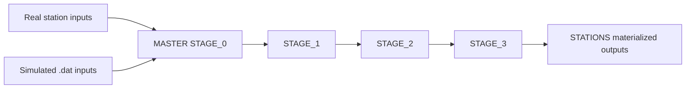

# Analysis Software (MASTER + STATIONS)

`MASTER` is the analysis mother code: it processes raw miniTRASGO station data and also processes simulated station-format inputs. Resulting station-scoped artifacts are materialized under `STATIONS/`.

## Stage model

| Stage | Purpose | Main location |
| --- | --- | --- |
| STAGE 0 | Acquire and buffer raw input files | `MASTER/STAGES/STAGE_0/` |
| STAGE 1 | Event cleaning and lab-log alignment | `MASTER/STAGES/STAGE_1/` |
| STAGE 2 | Environmental corrections and source integration | `MASTER/STAGES/STAGE_2/` |
| STAGE 3 | NMDB integration and enriched analytics | `MASTER/STAGES/STAGE_3/` |

Per-station trees and outputs live under `STATIONS/MINGO00` to `STATIONS/MINGO04`.

## Stage interaction diagram

## Typical workflow

1. STAGE 0 ingests new files into station queues.
2. STAGE 1 transforms raw inputs to cleaned event lists and aligned logs.
3. STAGE 2 applies corrections (pressure/temperature and related merges).
4. STAGE 3 finalizes integrated tables for monitoring and external reporting.

## Operational characteristics

- Cron-managed jobs with lock files and runtime logs in `OPERATIONS_RUNTIME/`.
- Per-station workflows with explicit queue/reprocessing metadata.
- Analysis jobs and ancillary jobs coordinated by resource-gate wrappers.

## Key scripts and helpers

- `MASTER/STAGES/STAGE_0/SIMULATION/ingest_simulated_station_data.py`
- `MASTER/STAGES/STAGE_1/EVENT_DATA/STEP_1/guide_raw_to_corrected.sh`
- `MASTER/STAGES/STAGE_1/EVENT_DATA/STEP_2/guide_corrected_to_accumulated.sh`
- `MASTER/STAGES/STAGE_1/EVENT_DATA/STEP_3/guide_accumulated_to_joined.sh`
- `OPERATIONS/OBSERVABILITY/AUDIT_PIPELINE_STATES/audit_pipeline_states.py`

## Primary operational references

- Cron behavior: <https://github.com/csoneira/DATAFLOW_v3/blob/main/DOCS/BEHAVIOUR/CRON_AND_SCHEDULING.md>
- Incident runbook: <https://github.com/csoneira/DATAFLOW_v3/blob/main/DOCS/REPO_DOCS/TROUBLESHOOTING/OPERATIONS_RUNBOOK.md>
- Governance rules: <https://github.com/csoneira/DATAFLOW_v3/blob/main/DOCS/REPO_DOCS/REPOSITORY_GOVERNANCE.md>
