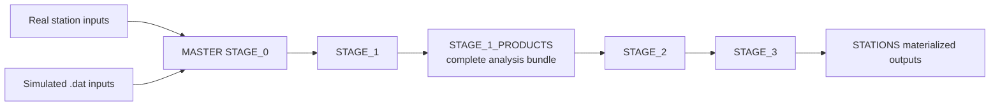

# Analysis Software (MASTER + STATIONS)

`MASTER` is the analysis mother code: it processes raw miniTRASGO station data and also processes simulated station-format inputs. Resulting station-scoped artifacts are materialized under `MINGO_ANALYSIS/MINGO_ANALYSIS_STATIONS/`.

## At a glance

| Item | Value |
| --- | --- |
| Upstream inputs | Real station DAQ/log streams + simulated `.dat` |
| Core engine | `MINGO_ANALYSIS/MINGO_ANALYSIS_SCRIPTS/STAGES/STAGE_0..3` |
| Materialized outputs | `MINGO_ANALYSIS/MINGO_ANALYSIS_STATIONS/MINGO0X/...` |
| Promotion gate | Stage progression and QA checks |

## Stage model

| Stage | Purpose | Main location |
| --- | --- | --- |
| STAGE 0 | Acquire and buffer raw input files | `MINGO_ANALYSIS/MINGO_ANALYSIS_SCRIPTS/STAGES/STAGE_0/` |
| STAGE 1 | Event cleaning plus creation of the complete `STAGE_1_PRODUCTS` bundle | `MINGO_ANALYSIS/MINGO_ANALYSIS_SCRIPTS/STAGES/STAGE_1/` |
| STAGE 2 | Accumulation/correction and integration from `STAGE_1_PRODUCTS` | `MINGO_ANALYSIS/MINGO_ANALYSIS_SCRIPTS/STAGES/STAGE_2/` |
| STAGE 3 | NMDB integration and enriched analytics | `MINGO_ANALYSIS/MINGO_ANALYSIS_SCRIPTS/STAGES/STAGE_3/` |

Per-station trees and outputs live under `MINGO_ANALYSIS/MINGO_ANALYSIS_STATIONS/MINGO00` to `MINGO_ANALYSIS/MINGO_ANALYSIS_STATIONS/MINGO04`.

## Stage interaction diagram

## Stage responsibilities

1. STAGE 0: ingest and queue.
2. STAGE 1: clean events and align log/Copernicus side products into a station-local product bundle.
3. STAGE 2: consume the Stage 1 product bundle, accumulate/correct event data, and join event/log/Copernicus sources.
4. STAGE 3: produce enriched station outputs.

## Stage 1 product contract

`MINGO_ANALYSIS/MINGO_ANALYSIS_STATIONS/MINGO0X/STAGE_1_PRODUCTS/` is the essential Stage 1 handoff directory. For downstream analysis, treat it as the complete reference bundle produced by Stage 1. It is designed to contain all data needed to analyze further without chasing transient task queues:

| Product family | Location under `STAGE_1_PRODUCTS/` | Role |
| --- | --- | --- |
| Event parquet lake | `EVENT_DATA/PARQUET_LAKE/` | Non-destructive processed event parquets, retaining raw/reference columns needed for later analysis. |
| Event metadata | `EVENT_DATA/METADATA/TASK_*/` | Task metadata snapshots and provenance for the event pipeline. |
| Log products | `LOG_DATA/OUTPUT_FILES/` | Cleaned and merged station log products. |
| Copernicus products | `COPERNICUS/OUTPUT_FILES/` | External atmospheric/environmental products aligned for later joining. |

Stage 2 jobs should read from this product bundle, not from Stage 1 task-local working queues, except when debugging an individual task.

## Operational characteristics

- Cron-managed jobs with lock files and runtime logs in `OPERATIONS/OPERATIONS_RUNTIME/`.
- Per-station workflows with explicit queue/reprocessing metadata.
- Analysis jobs and ancillary jobs coordinated by resource-gate wrappers.

## Common failure boundaries

| Boundary | Typical symptom |
| --- | --- |
| STAGE_0 -> STAGE_1 | New files present but no transform progression |
| STAGE_1_PRODUCTS -> STAGE_2 | Product bundle exists but accumulation/correction or joins do not update |
| STAGE_2 -> STAGE_3 | Corrected data exists but enriched outputs stale |

## Key scripts and helpers

- `MINGO_ANALYSIS/MINGO_ANALYSIS_SCRIPTS/STAGES/STAGE_0/SIMULATION/ingest_simulated_station_data.py`
- `MINGO_ANALYSIS/MINGO_ANALYSIS_SCRIPTS/STAGES/STAGE_1/EVENT_DATA/STEP_1/guide_raw_to_corrected.sh`
- `MINGO_ANALYSIS/MINGO_ANALYSIS_SCRIPTS/STAGES/STAGE_2/EVENT_DATA/STEP_1_ACCUMULATION/guide_corrected_to_accumulated.sh`
- `MINGO_ANALYSIS/MINGO_ANALYSIS_SCRIPTS/STAGES/STAGE_2/EVENT_DATA/STEP_2_DAILY_EVENT_DATA/guide_accumulated_to_joined.sh`
- `OPERATIONS/OPERATIONS_SCRIPTS/OBSERVABILITY/AUDIT_PIPELINE_STATES/audit_pipeline_states.py`

## Primary operational references

- Cron behavior: <https://github.com/csoneira/DATAFLOW_v3/blob/main/DOCS/BEHAVIOUR/CRON_AND_SCHEDULING.md>
- Incident runbook: <https://github.com/csoneira/DATAFLOW_v3/blob/main/DOCS/REPO_DOCS/TROUBLESHOOTING/OPERATIONS_RUNBOOK.md>
- Governance rules: <https://github.com/csoneira/DATAFLOW_v3/blob/main/DOCS/REPO_DOCS/REPOSITORY_GOVERNANCE.md>
