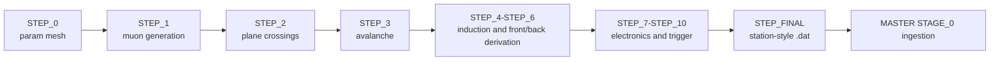

# Simulation (Digital Twin)

The MINGO digital twin models detector and electronics behavior from generated muons to station-style `.dat` outputs.

## Step domains

| Steps | Domain |
| --- | --- |
| STEP_0 | Parameter mesh generation (`param_mesh.csv`) |
| STEP_1-STEP_2 | Muon generation and transport to detector planes |
| STEP_3 | RPC avalanche model |
| STEP_4-STEP_6 | Strip induction, sharing, and front/back derivation |
| STEP_7-STEP_10 | Electronics offsets, FEE model, trigger, TDC jitter |
| STEP_FINAL | Output formatting (`.dat`) and registry updates |

## Simulation step flow



## SIM_RUN behavior

- STEP_1 to STEP_3 fan out from upstream combinations.
- STEP_4 to STEP_10 are one-to-one transformations.
- SIM_RUN names are immutable once created.
- `--force` is required to overwrite an existing run.

!!! warning "Reproducibility rule"
    If you use `--force`, document why overwrite was necessary and re-run validation checks for affected downstream outputs.

## Core paths

- Intersteps: `MINGO_DIGITAL_TWIN/INTERSTEPS/STEP_N_TO_N+1/`
- Output files: `MINGO_DIGITAL_TWIN/SIMULATED_DATA/FILES/`
- Orchestrator: `MINGO_DIGITAL_TWIN/ORCHESTRATOR/core/`
- Step implementations: `MINGO_DIGITAL_TWIN/MASTER_STEPS/`

## Example repository diagnostic figure


Source path:
- `DOCS/NOTEBOOKS/2026/02_FEBRUARY/FIGURES/2026_02_18_step3_eff2_eff3_theta.png`

## Metadata and reproducibility

Every step output is tied to lineage metadata and hashes, including:

- `config_hash`
- upstream hash/provenance
- step ID chain (`step_1_id` ... `step_10_id`)
- param set identifiers where applicable

Primary references:

- Architecture and orchestration: <https://github.com/csoneira/DATAFLOW_v3/blob/main/MINGO_DIGITAL_TWIN/DOCS/ARCHITECTURE_AND_ORCHESTRATION.md>
- Configuration and mesh: <https://github.com/csoneira/DATAFLOW_v3/blob/main/MINGO_DIGITAL_TWIN/DOCS/CONFIGURATION_AND_PARAM_MESH.md>
- Methods and data model: <https://github.com/csoneira/DATAFLOW_v3/blob/main/MINGO_DIGITAL_TWIN/DOCS/METHODS_AND_DATA_MODEL.md>
- Outputs and validation: <https://github.com/csoneira/DATAFLOW_v3/blob/main/MINGO_DIGITAL_TWIN/DOCS/OUTPUTS_METADATA_AND_VALIDATION.md>
- Troubleshooting runbook: <https://github.com/csoneira/DATAFLOW_v3/blob/main/MINGO_DIGITAL_TWIN/DOCS/TROUBLESHOOTING/RUNBOOK.md>

## Common commands

```bash
cd $HOME/DATAFLOW_v3/MINGO_DIGITAL_TWIN
./run_step.sh 1
./run_step.sh all
./run_step.sh --from 4 --no-plots
./run_step.sh final
./ORCHESTRATOR/core/run_main_simulation_cycle.sh
```
