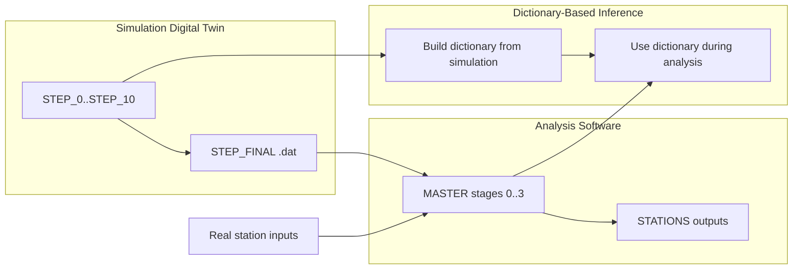

# 5-Minute System Model

This page is the fastest accurate mental model of DATAFLOW_v3 software.

## Three pillars in one table

| Pillar | Question answered | Main path |
| --- | --- | --- |
| Analysis software | What happened in real (or simulated) station data? | `MASTER/` -> `STATIONS/` |
| Simulation digital twin | What should the detector produce under controlled assumptions? | `MINGO_DIGITAL_TWIN/` |
| Dictionary-based inference | How do measured observables map to physics quantities? | `MINGO_DICTIONARY_CREATION_AND_TEST/`, `MASTER/common/` |

## System relationship

## What must be true

- Analysis behavior lives in `MASTER`, not scattered ad hoc in station folders.
- Real and simulated inputs are both processed through the same analysis mother code.
- Inference is versioned and traceable to simulation assumptions.
- Outputs are auditable at station scope under `STATIONS`.
- Quality gates decide promotion ([Project QA Plan](../project/quality-assurance.md)).

## If you only read three pages next

- [Software Invariants](invariants.md)
- [Real Data Trace](trace-real-data.md)
- [Simulated Data Trace](trace-simulated-data.md)
