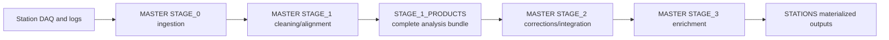

# Real Data Trace

This is the concrete path for real station data through the software stack.

## End-to-end trace

## Primary code ownership by segment

| Segment | Owner path |
| --- | --- |
| Ingestion and queueing | `MINGO_ANALYSIS/MINGO_ANALYSIS_SCRIPTS/STAGES/STAGE_0/` |
| Event/log/Copernicus transformations | `MINGO_ANALYSIS/MINGO_ANALYSIS_SCRIPTS/STAGES/STAGE_1/` |
| Complete Stage 1 product bundle | `MINGO_ANALYSIS/MINGO_ANALYSIS_STATIONS/MINGO0X/STAGE_1_PRODUCTS/` |
| Corrections and merges | `MINGO_ANALYSIS/MINGO_ANALYSIS_SCRIPTS/STAGES/STAGE_2/` |
| Final analytics/enrichment | `MINGO_ANALYSIS/MINGO_ANALYSIS_SCRIPTS/STAGES/STAGE_3/` |
| Output/state materialization | `MINGO_ANALYSIS/MINGO_ANALYSIS_STATIONS/MINGO0X/...` |

## Validation checkpoints

1. STAGE logs advance at expected cadence.
2. Queue movement is visible between stage boundaries.
3. `STAGE_1_PRODUCTS/` contains the complete downstream analysis bundle: event parquet lake, task metadata, log products, and Copernicus products.
4. No unexplained growth of error/reject directories.
5. Output files and metadata appear in expected station locations.

## Common failure boundaries

- Input acquisition/ingestion mismatch in STAGE_0.
- Partial transform completion in STAGE_1.
- Correction-source mismatch in STAGE_2.
- Final publication/enrichment gaps in STAGE_3.

For recovery commands and sequencing, use:
- [Operational Notes](../operations/index.md)
- [Troubleshooting](../troubleshooting/common-issues.md)

