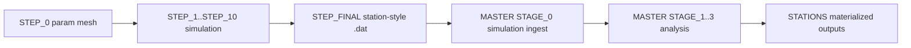

# Simulated Data Trace

This is the concrete path for simulated data from the digital twin into analysis outputs.

## End-to-end trace

## Interface boundary that matters most

The key contract boundary is:

- `MINGO_DIGITAL_TWIN/SIMULATED_DATA/FILES/*.dat` -> `MASTER/STAGES/STAGE_0/SIMULATION/ingest_simulated_station_data.py`

If this boundary drifts, downstream comparability between real and simulated analyses is degraded.

## Provenance-critical artifacts

- `step_final_output_registry.json`
- `step_final_simulation_params.csv`
- simulation metadata/hash sidecars/manifests

These must remain consistent with generated `.dat` files.

## Validation checkpoints

1. STEP_FINAL emits files and registries consistently.
2. Ingestion into `MASTER` occurs without schema/provenance mismatch.
3. Downstream station outputs are produced under expected `STATIONS` paths.
4. Hash/lineage checks pass in maintenance workflows.

## Operations references

- [Simulation Pipeline](simulation-pipeline.md)
- [Cron, Locks, and Maintenance](../operations/cron-and-maintenance.md)

