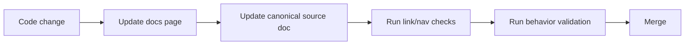

# Documentation Quality Checklist

Use this checklist before merging significant code or operational changes.

## Content quality

- The page states scope and audience.
- Terminology matches repository conventions (`MASTER`, `STATIONS`, `STEP_N`, `SIM_RUN`).
- Code paths are explicit and accurate.
- Behavior-impacting assumptions are clearly stated.

## Technical quality

- Commands are runnable or explicitly marked as examples.
- File paths and identifiers are current.
- Cross-links resolve.
- Diagrams match implementation behavior.

## Reproducibility quality

- Deterministic/non-deterministic behavior is described.
- Provenance and metadata implications are documented.
- Output locations and ownership are explicit.

## Operational quality

- Locking/scheduling impacts are mentioned for runtime changes.
- Incident or recovery procedures include verification steps.
- Any threshold/policy changes are documented with rationale.

## Review workflow

## Merge gate

A change is ready when reviewers can answer all three:

1. What changed?
2. How is it validated?
3. Where are the authoritative docs now?

!!! note "Practical standard"
    Any code change that alters outputs, thresholds, scheduling, or interface columns should fail review if documentation was not updated in the same change set.
