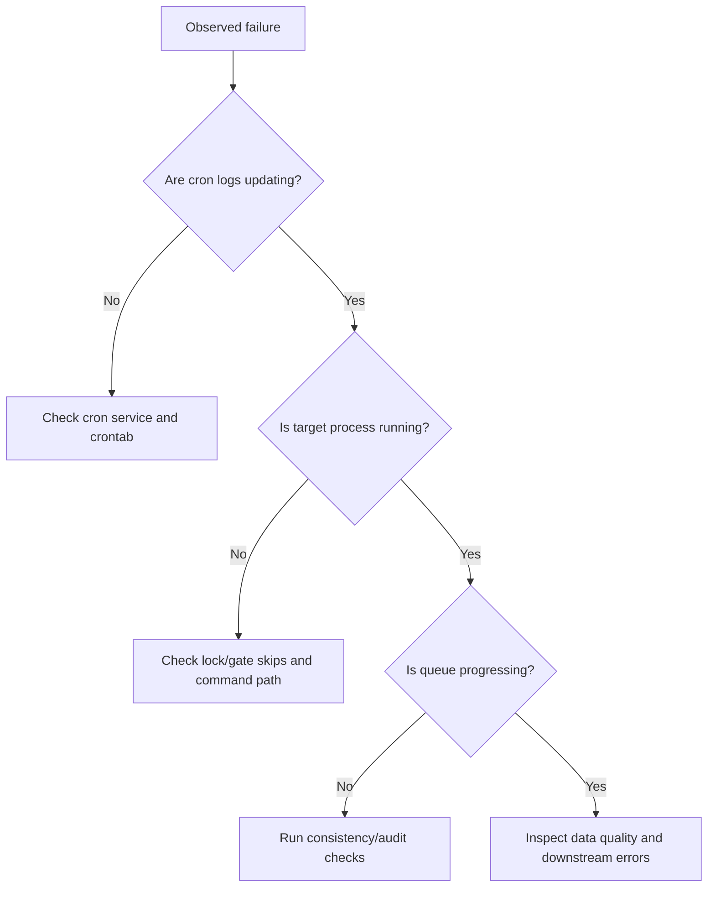

# Common Issues

## Triage decision tree



## Operational pipeline

### Symptom: stage logs stop updating

Likely causes:

- `cron` service is down
- lock contention or stale lock state
- broken cron path or environment variable

Checks:

```bash
service cron status
crontab -l
pgrep -af "guide_raw_to_corrected.sh -s"
```

### Symptom: process explosion in per-minute jobs

Likely cause:

- missing or ineffective per-job `flock` guard

Action:

- verify lock wrapper coverage in cron entries
- check resource-gate behavior and lock paths

### Symptom: queue does not drain

Likely causes:

- upstream stage failure
- corrupted/blocked queue metadata
- repeated downstream rejection

Action:

- run pipeline state audit script
- inspect per-station metadata and reject lists

## Simulation pipeline

### Symptom: pending mesh rows but no STEP_3 progress

Likely cause:

- missing required STEP_2 upstream `SIM_RUN` directories

Action:

- run consistency checker
- generate missing upstream outputs for pending prefixes

### Symptom: main cycle runs but STEP_0 is skipped repeatedly

Likely cause:

- backpressure gate is blocking new enqueue

Action:

- inspect pending simulated file counts
- tune `SIM_MAX_UNPROCESSED_FILES` if operationally justified

### Symptom: hash mismatches or missing simulation registry rows

Likely causes:

- hash normalization mismatch
- interrupted/non-atomic registry writes

Action:

- run `repair_orphan_hashes.py` workflow
- re-run `ensure_sim_hashes.py`

## Hardware and DAQ

### Symptom: no DAQ events or empty files

Checks:

- verify DAQ process is running
- verify hardware/network/TRB connectivity
- verify trigger and thresholds

### Symptom: correlation plots show axis-concentrated points

Likely causes:

- missing one-side strip readout
- swapped front/back channel wiring

Action:

- verify connectors and channel mapping

### Symptom: strips appear geometrically inconsistent

Likely cause:

- stale/incorrect TDC calibration

Action:

- rerun calibration workflow and validate outputs
