# MINGO_DIGITAL_TWIN

## Overview
The MINGO digital twin simulates RPC detector data from idealized muon generation through DAQ formatting and station-style .dat output. It is designed for traceability, validation, and iterative physics/electronics tuning.

Key points:
- Each step writes outputs to `INTERSTEPS/STEP_X_TO_Y/SIM_RUN_<N>` and records metadata in `sim_run_registry.json`.
- Configuration is split per step:
  - `config_step_X_physics.yaml` controls physics and sim-run identity.
  - `config_step_X_runtime.yaml` controls I/O, chunking, plotting, and run mode.
- A persistent `event_id` is carried through all steps for step-to-step alignment and debugging.

## Directory layout
- `MASTER_STEPS/STEP_<X>`: step scripts and configs
- `MASTER_STEPS/STEP_SHARED`: shared utilities and metadata helpers
- `INTERSTEPS/STEP_<X>_TO_<Y>`: per-step outputs and sim-run registries
- `SIMULATED_DATA`: final station-style `.dat` outputs

## Domain boundaries
The simulator enforces clean boundaries between physics and electronics domains:
- MUONS (primary particle + transport): STEP 1, STEP 2
- RPC Active Volume (gas gap microphysics): STEP 3
- RPC Induction + Readout Plane: STEP 4, STEP 5, STEP 6
- Electronics + DAQ: STEP 7, STEP 8, STEP 9, STEP 10
- Output formatting only: STEP FINAL

Boundary markers:
- Start of detector response: STEP 3
- Start of readout coupling: STEP 4
- Start of electronics: STEP 8
- Start of trigger-based event definition: STEP 9
- Start of digitization artifacts: STEP 10
- Formatting-only operations: STEP FINAL

## Pipeline flowchart (Mermaid)

```mermaid
flowchart TB

subgraph MU["MUONS (primary particle + transport)"]
  direction TB
  S1["STEP 1: Muon generation\n- Sample (x0,y0,z0), (theta,phi), v approx c, T0\n- Standard flux/angle distributions\nOutput: muon_sample_<N>"]:::mu
  S2["STEP 2: Muon propagation and plane crossings\n- Straight-line transport through station geometry\n- For each plane i: (xi,yi,zi), ti = T0 + Li/v\nOutput: geom_<G>"]:::mu
end

B1["BOUNDARY: detector response starts\nRPC Active Volume (gas gap)"]:::boundary

subgraph RPC["RPC (detector response)"]
  direction TB

  subgraph RPC_AV["RPC Active Volume (gas gap microphysics)"]
    direction TB
    S3["STEP 3: Ionization + avalanche in gas gap (NO readout)\n- N_ion, avalanche size Ne\n- Avalanche centroid/time (xa,ya,ta)\nOutput: geom_<G>_avalanche"]:::rpc_av
  end

  B2["BOUNDARY: readout coupling starts\nRPC Induction on Cu strips"]:::boundary

  subgraph RPC_IND["RPC Induction + Readout Plane"]
    direction TB
    S4["STEP 4: Induction footprint and affected strips\n- Map (xa,ya,Ne) to induced footprint\n- Determine hit strips and per-strip induced quantities\nOutput: geom_<G>_hit"]:::rpc_ind
    S5["STEP 5: Strip observables (still on-detector)\n- q_diff (charge imbalance/uncertainty proxy)\n- T_diff from x-position along strip\nOutput: geom_<G>_signal"]:::rpc_ind
    S6["STEP 6: Propagation along strip to both ends\n- Compute T_front/T_back and Q_front/Q_back\nOutput: geom_<G>_frontback"]:::rpc_ind
  end
end

B3["BOUNDARY: electronics chain starts\nConnectors/cables to FEE inputs"]:::boundary

subgraph ELEC["ELECTRONICS + DAQ"]
  direction TB

  subgraph CONN["Connectors / Cables (passive delays)"]
    direction TB
    S7["STEP 7: Connector/cable travel-time offsets\n- Apply delta t offsets from strip ends to FEE inputs\nOutput: geom_<G>_calibrated"]:::conn
  end

  B4["BOUNDARY: active electronics response starts\nFEE threshold + time pickoff"]:::boundary

  subgraph FEE["FEE (front-end electronics)"]
    direction TB
    S8["STEP 8: FEE model\n- Apply charge threshold Q_thr\n- Charge-to-time conversion / time-walk\nOutput: geom_<G>_threshold"]:::fee
  end

  B5["BOUNDARY: digitization and event definition\nTrigger logic + TDC time model"]:::boundary

  subgraph TDC["Trigger + TDC (DAQ logic and digitization)"]
    direction TB
    S9["STEP 9: Trigger coincidence selection\n- Keep only allowed plane combinations\nOutput: geom_<G>_triggered"]:::tdc
    S10["STEP 10: TDC/DAQ timing model\n- Apply TDC smear and clock jitter\nOutput: geom_<G>_daq"]:::tdc
  end
end

B6["BOUNDARY: formatting only\nEvent builder emulation"]:::boundary

subgraph OUT["OUTPUT (representation only)"]
  direction TB
  SF["STEP FINAL: Event builder formatting\n- Serialize to station-style .dat\nOutput: SIMULATED_DATA/mi0XYYDDDHHMMSS.dat"]:::fmt
end

S1 --> S2 --> B1 --> S3 --> B2 --> S4 --> S5 --> S6 --> B3 --> S7 --> B4 --> S8 --> B5 --> S9 --> S10 --> B6 --> SF

classDef mu fill:#eef7ff,stroke:#1b4965,stroke-width:1px,color:#0b2233;
classDef rpc_av fill:#eafaf1,stroke:#2d6a4f,stroke-width:1px,color:#0b2233;
classDef rpc_ind fill:#fff7e6,stroke:#8a5a00,stroke-width:1px,color:#0b2233;
classDef conn fill:#f7f0ff,stroke:#5a189a,stroke-width:1px,color:#0b2233;
classDef fee  fill:#f0e6ff,stroke:#5a189a,stroke-width:1px,color:#0b2233;
classDef tdc  fill:#fff0f3,stroke:#9d0208,stroke-width:1px,color:#0b2233;
classDef fmt  fill:#f2f2f2,stroke:#333333,stroke-width:1px,color:#0b2233;
classDef boundary fill:#ffffff,stroke:#555555,stroke-width:1px,color:#222222,stroke-dasharray: 4 3;
```


## Step-by-step summary
- STEP 1: Blank -> Generated
  - Script: `MASTER_STEPS/STEP_1/step_1_blank_to_generated.py`
  - Output: `INTERSTEPS/STEP_1_TO_2/SIM_RUN_<N>/muon_sample_<N>.(pkl|csv)`
  - Key fields: `event_id`, `X_gen`, `Y_gen`, `Z_gen`, `Theta_gen`, `Phi_gen`, `T0_ns`, `T_thick_s`

- STEP 2: Generated -> Crossing
  - Script: `MASTER_STEPS/STEP_2/step_2_generated_to_crossing.py`
  - Output: `INTERSTEPS/STEP_2_TO_3/SIM_RUN_<N>/geom_<G>.(pkl|csv)`
  - Key fields: `X_gen_i`, `Y_gen_i`, `Z_gen_i`, `T_sum_i_ns`, `tt_crossing`

- STEP 3: Crossing -> Avalanche
  - Script: `MASTER_STEPS/STEP_3/step_3_crossing_to_hit.py`
  - Output: `INTERSTEPS/STEP_3_TO_4/SIM_RUN_<N>/geom_<G>_avalanche.(pkl|csv)`
  - Key fields: `avalanche_size_electrons_i`, `avalanche_x_i`, `avalanche_y_i`, `tt_avalanche`

- STEP 4: Avalanche -> Hit
  - Script: `MASTER_STEPS/STEP_4/step_4_hit_to_measured.py`
  - Output: `INTERSTEPS/STEP_4_TO_5/SIM_RUN_<N>/geom_<G>_hit.(pkl|csv)`
  - Key fields: `Y_mea_i_sj`, `X_mea_i_sj`, `T_sum_meas_i_sj`, `tt_hit`

- STEP 5: Hit -> Signal (T_diff/q_diff)
  - Script: `MASTER_STEPS/STEP_5/step_5_measured_to_triggered.py`
  - Output: `INTERSTEPS/STEP_5_TO_6/SIM_RUN_<N>/geom_<G>_signal.(pkl|csv)`
  - Key fields: `T_diff_i_sj`, `q_diff_i_sj`

- STEP 6: Signal -> Front/Back
  - Script: `MASTER_STEPS/STEP_6/step_6_triggered_to_timing.py`
  - Output: `INTERSTEPS/STEP_6_TO_7/SIM_RUN_<N>/geom_<G>_frontback.(pkl|csv)`
  - Key fields: `T_front_i_sj`, `T_back_i_sj`, `Q_front_i_sj`, `Q_back_i_sj`

- STEP 7: Front/Back -> Calibrated
  - Script: `MASTER_STEPS/STEP_7/step_7_timing_to_uncalibrated.py`
  - Output: `INTERSTEPS/STEP_7_TO_8/SIM_RUN_<N>/geom_<G>_calibrated.(pkl|csv)`
  - Key fields: calibrated `T_front/T_back` and `Q_front/Q_back`

- STEP 8: Threshold (FEE model)
  - Script: `MASTER_STEPS/STEP_8/step_8_uncalibrated_to_threshold.py`
  - Output: `INTERSTEPS/STEP_8_TO_9/SIM_RUN_<N>/geom_<G>_threshold.(pkl|csv)`
  - Key fields: thresholded `Q_front/Q_back` and converted times

- STEP 9: Trigger
  - Script: `MASTER_STEPS/STEP_9/step_9_threshold_to_trigger.py`
  - Output: `INTERSTEPS/STEP_9_TO_10/SIM_RUN_<N>/geom_<G>_triggered.(pkl|csv)`
  - Key fields: `tt_trigger`

- STEP 10: DAQ timing model
  - Script: `MASTER_STEPS/STEP_10/step_10_triggered_to_jitter.py`
  - Output: `INTERSTEPS/STEP_10_TO_FINAL/SIM_RUN_<N>/geom_<G>_daq.(pkl|csv)`
  - Key fields: `daq_jitter_ns`, jittered `T_front/T_back`

- STEP FINAL: DAQ -> Station Dat
  - Script: `MASTER_STEPS/STEP_FINAL/step_final_daq_to_station_dat.py`
  - Output: `SIMULATED_DATA/mi0XYYDDDHHMMSS.dat`

## Interface contracts and conventions
- Per-step contracts: `DOCS/contracts/`
- Coordinate and timing definitions: `DOCS/coordinate_and_timing_conventions.md`

These docs describe required inputs, guaranteed outputs, invariants, and time/coordinate conventions to prevent sign and offset mistakes.

## Validation and debugging tools
- Single-event microscope: `tools/event_microscope.py`
- Timing closure checks: `tools/timing_closure.py`

Example usage:
```
python3 tools/event_microscope.py --sim-run SIM_RUN_0001 --geometry-id 0 --event-id 150
python3 tools/timing_closure.py --sim-run SIM_RUN_0001 --geometry-id 0 --max-events 50000 --fail-on-bad
```

## Notes
- Geometry IDs are global across stations: identical (P1, P2, P3, P4) share `geometry_id`.
- Each step writes metadata to a `.meta.json` alongside outputs.
- Plots (if enabled) are saved as a single PDF per output with a `_plots.pdf` suffix.
- Steps skip recomputation if the matching SIM_RUN exists unless `--force` is provided.
- STEP 1 flux and STEP 3 efficiencies can be lists; one option is chosen per run and used for SIM_RUN identity.

## Outputs
- Intermediate outputs: `INTERSTEPS/STEP_X_TO_Y/SIM_RUN_<N>`
- Final station-style data: `SIMULATED_DATA/mi0XYYDDDHHMMSS.dat`
