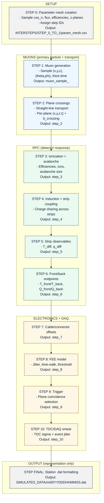

# MINGO_DIGITAL_TWIN

## Overview
MINGO_DIGITAL_TWIN is a parameterized digital twin for RPC detector data that walks a muon event
from idealized generation through gas-gap response, strip induction, front-end electronics, DAQ,
and station-style .dat formatting. The pipeline is designed for traceability and reproducibility:
intermediate data products are saved per step, and each output is annotated with metadata that
records configuration, upstream lineage, and sim-run identities.

Key design goals:
- Deterministic step boundaries between physics, readout, and electronics domains.
- Explicit parameter mesh for scanning geometry/efficiency/flux configurations.
- Per-step artifacts (.pkl/.csv or chunked manifests) with metadata and sim-run registry tracking.

## Scope and boundaries
Physical vs electronics domains are split explicitly by step:
- MUONS (primary particle + transport): STEP 1, STEP 2
- RPC Active Volume (gas gap microphysics): STEP 3
- RPC Induction + Readout Plane: STEP 4, STEP 5, STEP 6
- Electronics + DAQ: STEP 7, STEP 8, STEP 9, STEP 10
- Output formatting only: STEP FINAL

Boundary markers (first appearance of each effect):
- Detector response begins at STEP 3.
- Readout coupling begins at STEP 4.
- Electronics effects begin at STEP 8.
- Trigger-based event definition begins at STEP 9.
- Digitization artifacts begin at STEP 10.
- Formatting-only operations occur at STEP FINAL.

## Pipeline overview (Mermaid)


## Directory layout
- `MASTER_STEPS/STEP_<X>`: per-step scripts and configs.
- `MASTER_STEPS/STEP_SHARED`: shared utilities (sim-run registry, chunked I/O, geometry helpers).
- `INTERSTEPS/STEP_<X>_TO_<Y>`: per-step outputs and sim-run registries.
- `INTERSTEPS/STEP_0_TO_1`: parameter mesh (param_mesh.csv) for step-ID selection.
- `SIMULATED_DATA`: station-style .dat outputs and step_final registries.
- `DOCS`: technical documentation, data dictionary, and interface contracts.

## Running the pipeline
Step 0 (parameter mesh):
```
python3 MASTER_STEPS/STEP_0/step_0_setup_to_blank.py \
  --config MASTER_STEPS/STEP_0/config_step_0_physics.yaml
```

Step-by-step or all steps:
```
./run_step.sh 1
./run_step.sh all
./run_step.sh --from 4 --no-plots
```

Each step script accepts:
- `--config` (physics parameters)
- `--runtime-config` (I/O, chunking, plots)
- `--plot-only` or `--no-plots`
- `--force` to overwrite an existing SIM_RUN

## Data products and metadata
- Outputs are either single files (`.pkl` or `.csv`) or chunked manifests (`*.chunks.json`).
- Every output has metadata (sidecar `.meta.json` or manifest `metadata`), including:
  `step`, `config`, `runtime_config`, `sim_run`, `config_hash`, `upstream_hash`, and lineage.
- Each step maintains a `sim_run_registry.json` in its INTERSTEPS directory.

## Documentation map
- Methods and modeling details: `DOCS/methods_overview.md`
- Data dictionary and column definitions: `DOCS/data_dictionary.md`
- Configuration reference: `DOCS/config_reference.md`
- Metadata and reproducibility: `DOCS/metadata_and_reproducibility.md`
- Parameter mesh specification: `DOCS/param_mesh.md`
- Coordinate and timing conventions: `DOCS/coordinate_and_timing_conventions.md`
- Station .dat format: `DOCS/station_dat_format.md`
- Tooling and validation: `DOCS/tools_and_validation.md`
- Per-step interface contracts: `DOCS/contracts/`
